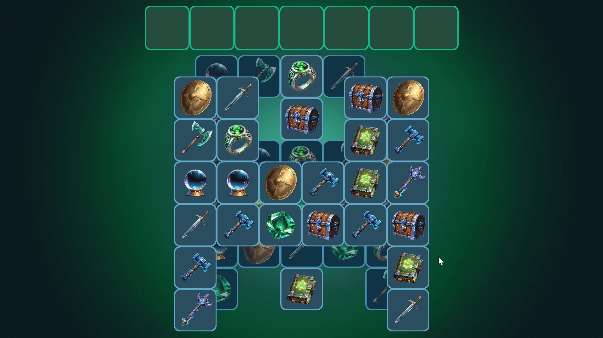

# Triple Match Frenzy

A Unity implementation of the core mechanics of a triple-match puzzle game, inspired by
[Tile Explorer - Triple Match](https://play.google.com/store/apps/details?id=com.oakever.tiletrip&hl=en).



You can play a desktop version of the game on Itch.io [here](https://wgrodzicki.itch.io/triple-match-frenzy).

---

## Gameplay

- Tiles are arranged across **3 stacked grid layers** with a half-tile offset between layers,
  creating a partial occlusion effect
- Only **unoccluded tiles** (not covered by tiles on higher layers) are selectable
- Selected tiles move into a **7-slot tray** at the top of the screen
- When **3 matching tiles** land in the tray they are automatically removed
- **Win** by clearing all tiles from the board
- **Lose** if the tray fills up with no matching triple possible

---

## Architecture

The project is structured around clean separation of concerns and single-responsibility components:

| System | Responsibility |
|---|---|
| `GridGenerator` | Procedural board generation — per-row randomized fill with left/right symmetry, even/odd/even layer column pattern, Fisher-Yates tile type shuffle |
| `OcclusionGraph` | Built at generation time via pure array lookups; tracks blocker lists per tile; O(1) selectability checks; updated on tile removal |
| `TileView` | MonoBehaviour per tile; owns 3 SpriteRenderers (background, foreground, icon); sorting order bands per grid layer; no input logic |
| `GameManager` | Singleton; owns the game state machine (Loading → Idle → Animating → Checking → Won/Lost); coordinates all systems; async flow via UniTask |
| `Tray` | 7-slot UI tray; manages UI clone spawning, pooling, match detection, and slot collapse |
| `TrayClonePool` | Object pool for UI Image clones |
| `TweenController` | All DoTween calls centralized here; exposes awaitable UniTask methods; no game logic |
| `AddressablesLoader` | Async loads Tile prefab and TileTypeLibrary SO via Addressables on startup; releases handles on destroy |
| `EndGameUI` | TMP overlay activated on win/lose; fades in via DoTween |

### Key design decisions

- **OcclusionGraph over raycasting** — occlusion is computed once at generation time rather
  than via Physics raycasts on each tap, keeping selection checks O(1) and fully data-driven
- **RaycastAll for input** — `Physics2D.RaycastAll` with `OrderByDescending(LayerIndex)` ensures
  the topmost grid layer tile is always selected when tiles overlap, matching expected gameplay behavior
- **Sorting order bands over Z offset** — SpriteRenderers use `layerIndex * 3` as a base sorting
  order for sub-tile children (background/foreground/icon), since Unity's SpriteRenderer
  ignores Z position for draw order
- **UI clone pooling** — world-space tiles are hidden on selection; pooled UI Image clones
  are spawned at the exact screen-space equivalent position via `WorldToScreenPoint` +
  `ScreenPointToLocalPointInRectangle`, creating a seamless world→UI tween with no visible seam
- **Async state machine** — input is blocked during animations via game state; all tween
  sequences are awaited via UniTask before state advances, preventing race conditions
- **Addressables for asset loading** — Tile prefab and TileTypeLibrary loaded asynchronously
  at startup and released on destroy, signalling mobile optimization awareness

---

## Tech Stack

- **Unity** 6 (URP, Universal 2D template)
- **DoTween** — tween animations
- **UniTask** — async/await without C# Task overhead
- **Unity Input System** — pointer input handling
- **Addressables** — async asset loading

### Required packages
These are not included in the repository. Download and install them before running the project:

- TMP Essential Resources package
- [DOTween (HOTween v2)](https://assetstore.unity.com/packages/tools/animation/dotween-hotween-v2-27676) — free
- [50 Free Stylized Icons](https://assetstore.unity.com/packages/2d/50-free-stylized-icons-307753) — free

After importing DoTween, run the setup wizard via **Tools > Demigiant > DOTween Utility Panel**.

### Scripting define symbols
Add the following under **Edit > Project Settings > Player > Other Settings > Scripting Define Symbols**:
```
UNITASK_DOTWEEN_SUPPORT
```

---

## AI-Assisted Development

This project was built using a deliberate AI-assisted workflow. Here is a transparent breakdown of how that looked in practice:

### Tools used
- **Claude (Anthropic)** — architecture design, key design decisions, and structured prompt authoring
- **Claude Code + Unity MCP** — code generation and partial Editor automation from structured prompts

### Workflow
The implementation was split into three phases:

**Phase 1 — Initial architecture, design and technique ideas**

This was an initial phase where I thought about the best architectural approaches, broad design decisions as well as techniques/algorithms to use before consulting it with the AI.

**Phase 2 — Architecture (with Claude in chat)**

Before writing a single line of code, I used Claude to work through the full architecture:
system breakdown, data model design, occlusion detection strategy, rendering approach,
input handling, coordinate space decisions, and tween sequencing. Every decision was
challenged and iterated — for example, the initial corner-raycast occlusion approach was
replaced with a generation-time OcclusionGraph after identifying correctness issues with
the half-tile offset pattern. This phase produced a detailed spec that drove all subsequent
code generation.

**Phase 3 — Implementation (with Claude Code + MCP)**

The spec was broken into 8 structured prompts, each targeting one isolated system with
explicit inputs, outputs, and notes. Claude Code generated the implementation; I reviewed
each output, caught issues,
made architectural adjustments, and handled Editor wiring that MCP could not automate.

### What this workflow demonstrates
- AI was used as a force multiplier, not a replacement for engineering judgment
- Every architectural decision was made deliberately, with tradeoffs considered
- Issues introduced by code generation were caught through active review and testing
- The result reflects the same design thinking that would go into a hand-written implementation,
  delivered in a fraction of the time
